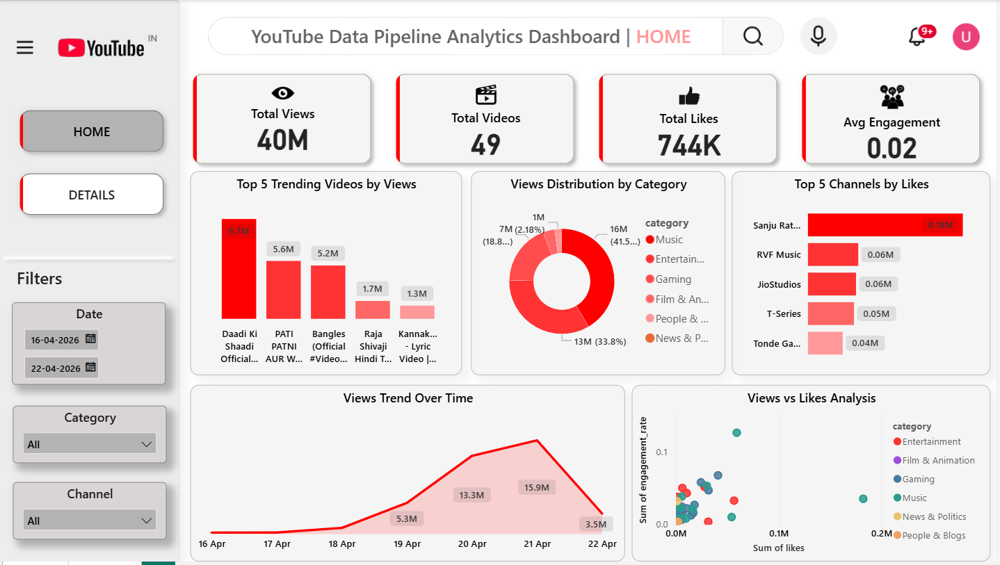
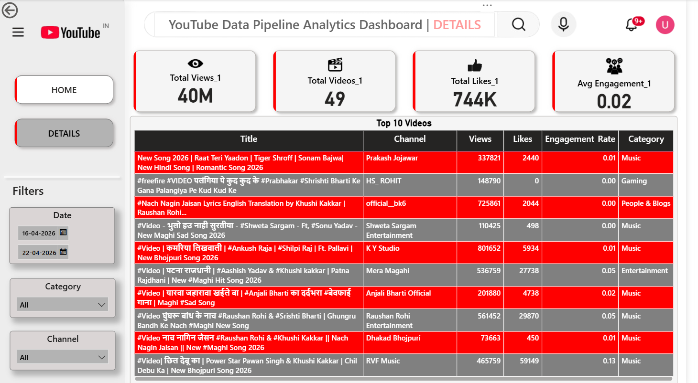

#  YouTube Data Pipeline (ETL) & Analytics Dashboard

An end-to-end **data engineering + analytics project** that extracts trending YouTube data using API, processes it using Python, stores it in MySQL, and visualizes insights through an interactive Power BI dashboard.

---

## Project Overview

This project demonstrates a complete **ETL pipeline**:

📥 Extract → 🧹 Transform → 💾 Load → 📊 Visualize  

- Extract trending YouTube videos using API  
- Clean and transform raw data using Python (Pandas)  
- Store structured data in MySQL database  
- Perform analysis using SQL  
- Build interactive dashboard in Power BI  

---

## Problem Statement

Analyzing YouTube trending data manually is difficult due to:
- Unstructured API data  
- Large data volume  
- Lack of ready insights  

This project automates the process and provides meaningful insights like:
- Top performing videos  
- Category-wise performance  
- Engagement trends  
- Time-based analysis  

---

##  Tech Stack

- Python (Pandas, API Integration)  
- YouTube Data API v3  
- MySQL  
- SQL  
- Power BI  

---

## ETL Pipeline

### 📥 Extract
- Data fetched using YouTube API  
- Region: India (Trending Videos)  
- Fields:
  - title  
  - channel  
  - views  
  - likes  
  - category_id  
  - publish_date  

---

### 🧹 Transform
- Converted views & likes → numeric  
- Converted publish_date → datetime  
- Mapped category_id → category name  
- Created new feature:
  
  **engagement_rate = likes / views**

- Removed missing values  

---

### 💾 Load
- Loaded processed data into MySQL  
- Table name: `trending_videos`  
- Enabled efficient querying  

---

## 📂 Dataset

### 🔹 Raw Data
- `data/raw_data.csv`  
- Direct API output  
- Unstructured  

### 🔹 Processed Data
- `data/processed_data.csv`  
- Cleaned and structured  
- Ready for analysis  

---

## Power BI Dashboard

###  Features:
- KPI Cards:
  - Total Views  
  - Total Likes  
  - Total Videos  
  - Avg Engagement Rate  

- Visualizations:
  - Top Videos by Views  
  - Category Distribution  
  - Channel Performance  
  - Views Trend Over Time  
  - Views vs Likes (Scatter Plot)  

---

##  Dashboard Preview

###  Home Page


###  Details Page


---

##  Key Insights

- A small number of videos generate the majority of views  
- Music and Entertainment dominate trending content  
- High views do not always mean high engagement  
- Some low-view videos achieve higher engagement rates  

---

## 📁 Project Structure
youtube-etl-project/
│
├── assets/              # Dashboard screenshots  
├── data/                # Raw & processed datasets  
├── notebooks/           # ETL pipeline notebooks  
├── sql_queries.sql      # SQL analysis  
├── dashboard.pbix       # Power BI dashboard  
├── project_report.pdf   # Documentation  
├── presentation.pptx    # PPT  
└── README.md  

---

##  How to Run

###  Clone Repository
```bash
git clone https://github.com/your-username/youtube-etl-dashboard.git
cd youtube-etl-dashboard
